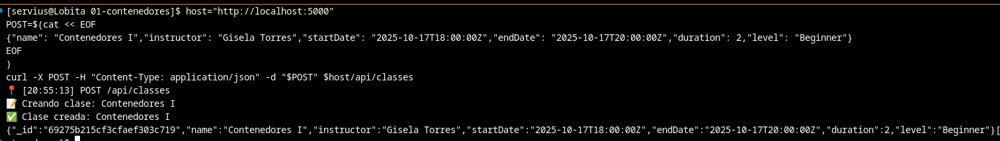
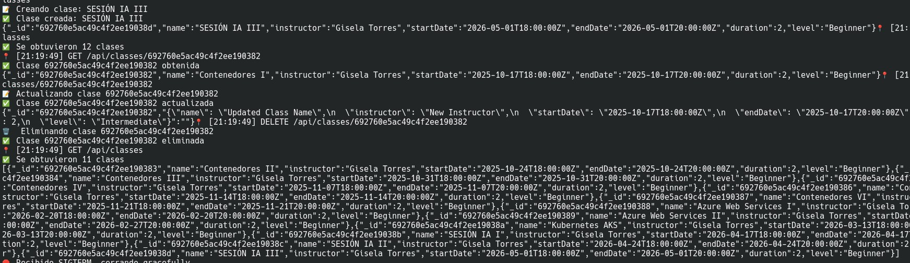
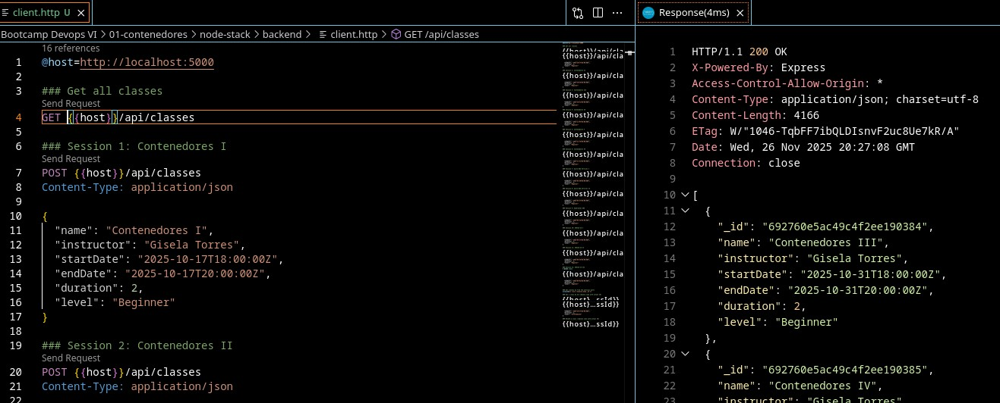
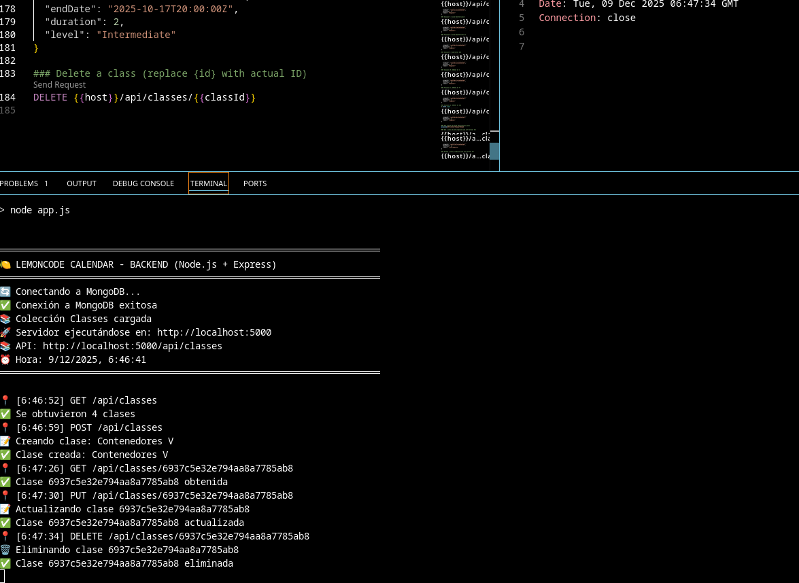

# Ejercicios


## Reto 1 MongoDB en Contenedor

### 1. Crear una red Docker para la comunicación
#### Crear la red modo bridge
```bash
docker network create challenge-net
```


### 2. Ejecutar MongoDB en un contenedor con persistencia de datos
#### Creando los volúmenes
```bash
docker volume create mongo-data
docker volume create mongo-conf
```

#### Creando el contenedor
```bash
docker run -d \
    --name mongo-challenge \
    --mount type=volume,source=mongo-data,target=/data/db \
    --mount type=volume,source=mongo-conf,target=/data/configdb \
    --memory="4g" --cpus="4" \
    --network challenge-net \
    -p 27017:27017 \
    mongo:8.2.1
```
### 3. Ejecutar el backend localmente conectándose a tu nuevo MongoDB
#### Archivo .env
```bash
DATABASE_URL=mongodb://localhost:27017
DATABASE_NAME=LemoncodeCourseDb
HOST=localhost
PORT=5000
```

> Nota: Solo se mantiene así para la conexión con el backend en local, lo de node-stack estará diferentes según los siguientes retos.

### 4. Verificar que el CRUD funciona correctamente usando la extensión REST Client y el archivo backend/client.http del stack que hayas elegido
#### Con comandos de curl

```bash
host="http://localhost:5000"
POST=$(cat << EOF
{"name": "Contenedores I","instructor": "Gisela Torres","startDate": "2025-10-17T18:00:00Z","endDate": "2025-10-17T20:00:00Z","duration": 2,"level": "Beginner"}
EOF
)
curl -X POST -H "Content-Type: application/json" -d "$POST" $host/api/classes
```



##### En [reto_1_comandos_bash.sh](./reto1_comandos_bash.sh) están todas las API call que nos disteis con [client.http](./node-stack/backend/client.http), las usé todas de golpe para probar la API y generar la semilla. No hace falta para el ejercicio esa parte, pero las dejé ahí. Dejo imagen de prueba también.



#### con la extensión REST Client de VS Code




## Reto 2 Dockerizar el Backend

### 1. Crear un Dockerfile para el backend
#### Archivo dockerfile

```Dockerfile
# syntax=docker/dockerfile:1

ARG NODE_VERSION=22.21.1

FROM node:22-alpine3.21

ENV NODE_ENV=production

LABEL maintainer="sdesagallego@gmail.com"
LABEL project="lemoncode-challenge-containers"

WORKDIR /usr/src/nodeapp

RUN --mount=type=bind,source=package.json,target=package.json \
    --mount=type=bind,source=package-lock.json,target=package-lock.json \
    --mount=type=cache,target=/root/.npm \
    npm ci --omit=dev

COPY . .
RUN chown -R node /usr/src/nodeapp

USER node

EXPOSE 5000

CMD [ "npm", "start"]
```
> Nota: El archivo de .env se cambió a lo siguiente:

```bash
DATABASE_URL=mongodb://localhost:27017
DATABASE_NAME=LemoncodeCourseDb
HOST=localhost
PORT=5000
```


### 2. Construir la imagen del backend
#### Comando para construir la imagen

```bash
docker build . -f Dockerfile -t node-app-backend:v1.2
```

### 3. Ejecutar el backend en un contenedor en la red Docker que creaste en el Reto 1
#### Comando para ejecutar el contenedor del backend
```bash
docker run -d \
    --name $container_backend \
    --mount type=bind,source=./backend-build/.env,target=/usr/src/nodeapp/.env \
    --memory="4g" --cpus="4" \
    --network challenge-net \
    -p 5000:5000 \
    node-app-backend:v1.2
```

### 4. Verificar que se conecta a MongoDB
#### Capturas de la conexión exitosa y del CRUD testing


