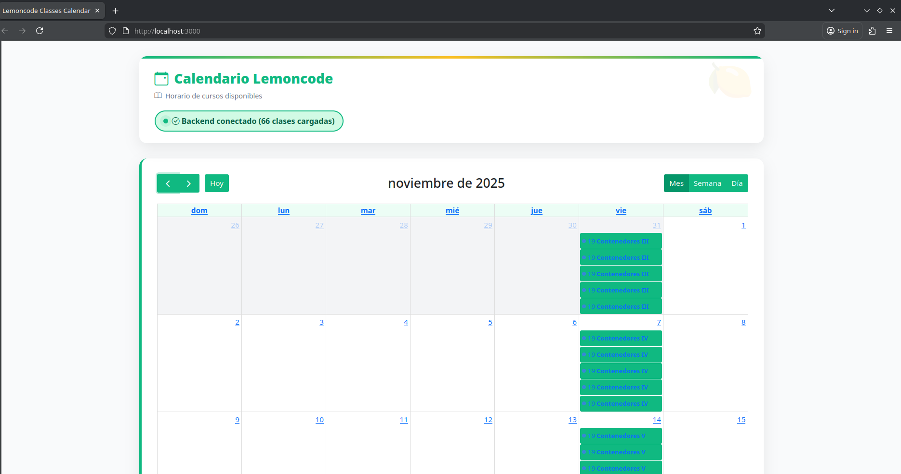
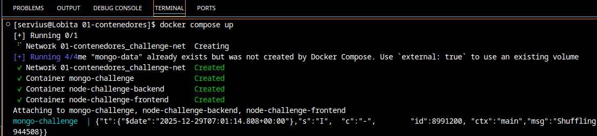
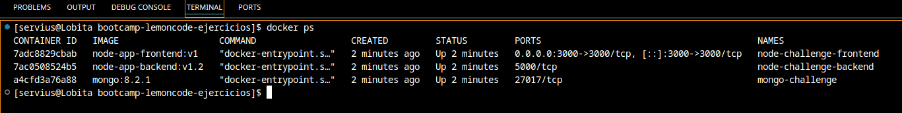

# Ejercicios


## Reto 1 MongoDB en Contenedor

### 1. Crear una red Docker para la comunicación
#### Crear la red modo bridge
```bash
docker network create challenge-net
```


### 2. Ejecutar MongoDB en un contenedor con persistencia de datos
#### Creando los volúmenes
```bash
docker volume create mongo-data
docker volume create mongo-conf
```

#### Creando el contenedor de mongo
```bash
docker run -d \
    --name mongo-challenge \
    --mount type=volume,source=mongo-data,target=/data/db \
    --mount type=volume,source=mongo-conf,target=/data/configdb \
    --memory="4g" --cpus="4" \
    --network challenge-net \
    -p 27017:27017 \
    mongo:8.2.1
```
### 3. Ejecutar el backend localmente conectándose a tu nuevo MongoDB
#### Archivo [.env](./node-stack-local-testing/backend/.env)
```bash
DATABASE_URL=mongodb://localhost:27017
DATABASE_NAME=LemoncodeCourseDb
HOST=localhost
PORT=5000
```

> Nota: Solo se mantiene así para la conexión con el backend en local, lo de node-stack estará diferente según los siguientes retos.

### 4. Verificar que el CRUD funciona correctamente usando la extensión REST Client y el archivo backend/client.http del stack que hayas elegido
#### Con comandos de curl

```bash
host="http://localhost:5000"
POST=$(cat << EOF
{"name": "Contenedores I","instructor": "Gisela Torres","startDate": "2025-10-17T18:00:00Z","endDate": "2025-10-17T20:00:00Z","duration": 2,"level": "Beginner"}
EOF
)
curl -X POST -H "Content-Type: application/json" -d "$POST" $host/api/classes
```


##### En [reto_1_comandos_bash.sh](./reto1_comandos_bash.sh) están todas las API call que nos disteis con [client.http](./node-stack/backend/client.http), las usé todas de golpe para probar la API y generar la semilla. Esa parte no hace falta para el ejercicio, pero las dejé ahí. Dejo imagen de prueba que todo funcionó también.


#### con la extensión REST Client de VS Code


## Reto 2 Dockerizar el Backend

### 1. Crear un Dockerfile para el backend
#### Archivo dockerfile que se encuentra en [backend Dockerfile](./docker-image-build/backend-build/Dockerfile)

```Dockerfile
# syntax=docker/dockerfile:1

ARG NODE_VERSION=22.21.1

FROM node:22-alpine3.21

ENV NODE_ENV=production

LABEL maintainer="sdesagallego@gmail.com"
LABEL project="lemoncode-challenge-containers"

WORKDIR /usr/src/nodeapp

RUN --mount=type=bind,source=package.json,target=package.json \
    --mount=type=bind,source=package-lock.json,target=package-lock.json \
    --mount=type=cache,target=/root/.npm \
    npm ci --omit=dev

COPY . .
RUN chown -R node /usr/src/nodeapp

USER node

EXPOSE 5000

CMD [ "npm", "start"]
```

### Archivo [.env](./docker-image-build/backend-build/.env)

```bash
DATABASE_URL=mongodb://localhost:27017
DATABASE_NAME=LemoncodeCourseDb
HOST=localhost
PORT=5000
```


### 2. Construir la imagen del backend
#### Comando para construir la imagen

```bash
docker build . -f Dockerfile -t node-app-backend:v1.2
```

### 3. Ejecutar el backend en un contenedor en la red Docker que creaste en el Reto 1
#### Comando para ejecutar el contenedor del backend
```bash
docker run -d \
    --name node-challenge-backend \
    --mount type=bind,source=./docker-image-build/backend-build/.env,target=/usr/src/nodeapp/.env \
    --memory="4g" --cpus="2" \
    --network challenge-net \
    -p 5000:5000 \
    node-app-backend:v1.2
```


### 4. Verificar que se conecta a MongoDB
#### Capturas de la conexión exitosa y del CRUD testing


## Reto 3 Dockerizar el Frontend

### 1 Crear un Dockerfile para el frontend
#### Archivo dockerfile que se encuentra en [frontend Dockerfile](./docker-image-build/frontend-build/Dockerfile)
```Dockerfile
# syntax=docker/dockerfile:1

FROM node:22-alpine3.21

ENV NODE_ENV=production

LABEL maintainer="sdesagallego@gmail.com"
LABEL project="lemoncode-challenge-containers"

WORKDIR /usr/src/nodeapp

RUN --mount=type=bind,source=package.json,target=package.json \
    --mount=type=bind,source=package-lock.json,target=package-lock.json \
    --mount=type=cache,target=/root/.npm \
    npm ci --omit=dev

COPY . .
RUN chown -R node /usr/src/nodeapp

USER node

EXPOSE 3000

CMD [ "npm", "start"]
```


### 2. Construir la imagen del frontend
#### Comando para construir la imagen

```bash
    docker build . -f Dockerfile -t node-app-frontend:v1
```

### 3. Ejecutar el frontend en un contenedor en la red Docker
#### Comando para ejecutar el contenedor del frontend

```bash
docker run -d \
    --name node-challenge-frontend \
    --mount type=bind,source=.env,target=/usr/src/nodeapp/.env \
    --memory="4g" --cpus="2" \
    --network challenge-net \
    -p 3000:3000 \
    node-app-frontend:v1
```

### 4. Configurar las variables de entorno para conectarse al backend en http://topics-api:5000/api/classes
#### Archivo [.env](./docker-image-build/frontend-build/.env)
```bash
API_URL="http://node-challenge-backend:5000/api/classes"
```


### 5 Acceder a la interfaz desde el puerto 3000



## Reto 4 Docker Compose - Todo junto

### 1 Archivo *compose.yaml* completo y documentado con comentarios

```yaml
services:
  mongo-challenge:
    container_name: mongo-challenge
    image: mongo:8.2.1
    volumes:
    # el volumen de conf no llego a hacer falta pero lo mantuve
      - mongo-data:/data/db
      - mongo-conf:/data/configdb
    restart: always
    # reinicia el contenedor siempre (tanto al arrancar la maquina como si el contenedor se cierra por algun fallo)
    deploy:
    # delimita los recursos máximos del contenedor
      resources:
        limits:
          cpus: '4.0'
          memory: 4G
    networks:
    # encaja el contenedor en la red de la aplicación
      - challenge-net

  node-challenge-backend:
    depends_on:
    # esperará a que el contenedor descrito este up antes de iniciar nada
      - mongo-challenge
    container_name: node-challenge-backend
    image: node-app-backend:v1.2
    restart: always
    environment:
    # en lugar de mantener las variables de entorno en un archivo externo preferí tenerlas así
      DATABASE_URL: mongodb://mongo-challenge:27017
      DATABASE_NAME: LemoncodeCourseDb
      HOST: 0.0.0.0
      PORT: 5000
    deploy:
      resources:
        limits:
          cpus: '2.0'
          memory: 4G
    networks:
      - challenge-net

  node-challenge-frontend:
    depends_on:
      - node-challenge-backend
    container_name: node-challenge-frontend
    image: node-app-frontend:v1
    restart: always
    environment:
      API_URL: "http://node-challenge-backend:5000/api/classes"
    ports:
      - "3000:3000"
    deploy:
      resources:
        limits:
          cpus: '2.0'
          memory: 4G
    networks:
      - challenge-net


volumes:
  mongo-data:
    name: mongo-data
  mongo-conf:
    name: mongo-conf
networks:
  challenge-net:
```

# 2 Archivo *.env* (si es necesario) con variables de entorno

> Para el compose mantuve las variables de entorno dentro del yaml por comodidad

# 3 Comando docker-compose up ejecutándose exitosamente


# 4 Captura de pantalla de todos los servicios corriendo (docker ps)


# 5 Captura de pantalla de la aplicación completa en http://localhost:3000
